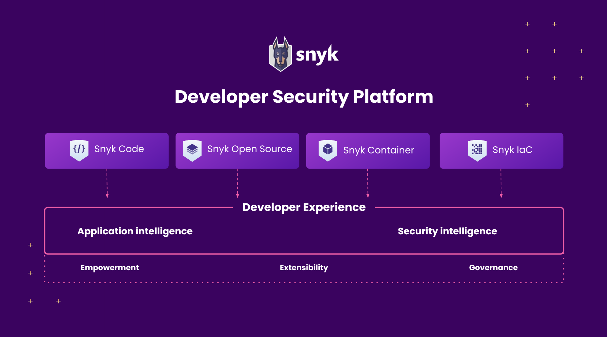

::: {.section lang="en" lang="en" dir="ltr" data-permalink="snyk-user-documentation.html"}
::: {.titlepage}

::: {.title}
[]{#UUID-9c59209e-cdb5-b414-c551-315a72c2dcd9}Snyk User Documentation {#snyk-user-documentation .title style="clear: both"}
---------------------------------------------------------------------
:::

:::

::: {.tip lang="en" lang="en" dir="ltr" style="margin-left: 0.5in; margin-right: 0.5in;"}
![\[Tip\]](../css/image/tip.png)
:::
:::

[]{#UUID-9c59209e-cdb5-b414-c551-315a72c2dcd9_UUID-395a3a65-0e52-ea44-52b0-58fa2cf17003}Tip

[Sign up to use Snyk for
free!](https://snyk.io/login?cta=sign-up&loc=nav&page=support_docs_page){.link}

::: {.section lang="en" lang="en" dir="ltr"}
::: {.titlepage}

::: {.title}
### []{#UUID-9c59209e-cdb5-b414-c551-315a72c2dcd9_UUID-cccb0ca1-c65e-5f4a-ee5d-204ccc80d452}What is Snyk? {#what-is-snyk .title}
:::

:::

Snyk is a Developer Security Platform that integrates directly into
development tools and automation pipelines, making it easy to find,
prioritize, and fix security vulnerabilities in code, dependencies,
containers, and infrastructure as code. Backed by industry-leading
vulnerability intelligence, and designed by developers for developers,
Snyk fits into your development workflow to put security expertise in
your toolkit.

::: {.mediaobject}

:::
:::

::: {.section lang="en" lang="en" dir="ltr"}
::: {.titlepage}

::: {.title}
### []{#UUID-9c59209e-cdb5-b414-c551-315a72c2dcd9_UUID-452f8f0e-7e77-21b3-2d70-33ff8f2b4916}What can I do with Snyk? {#what-can-i-do-with-snyk .title}
:::

:::

::: {.itemizedlist}
-   [Snyk Open
    Source:](https://snyk.io/product/open-source-security-management/){.link}
    Find and automatically fix open source vulnerabilities.

-   [Snyk Code:](https://snyk.io/product/snyk-code/){.link} Find and fix
    vulnerabilities in your application code in real time.

-   [Snyk
    Container:](https://snyk.io/product/container-vulnerability-management/){.link}
    Find and fix vulnerabilities in container images and Kubernetes
    workloads.

-   [Snyk Infrastructure as Code
    (IaC):](https://snyk.io/product/infrastructure-as-code-security/){.link}
    Find and fix misconfigurations in Terraform, CloudFormation,
    Kubernetes, and Azure templates.
:::
:::

::: {.section lang="en" lang="en" dir="ltr"}
::: {.titlepage}

::: {.title}
### []{#UUID-9c59209e-cdb5-b414-c551-315a72c2dcd9_UUID-21ea2d90-2cc5-c0e2-5fef-ab07623c590e}How can I use Snyk? {#how-can-i-use-snyk .title}
:::

:::

You can use Snyk with:

::: {.itemizedlist}
-   [Snyk Web
    UI](https://github.com/snyk/user-docs/blob/main/docs/snyk-web-ui){.link}
    to access browser-based scanning functions, view results and show
    reports.

-   [Snyk
    CLI](https://github.com/snyk/user-docs/blob/main/docs/snyk-cli){.link}
    to scan applications, containers, and infrastructure as code for
    security vulnerabilities.

-   [Snyk API](https://snyk.docs.apiary.io/#introduction/api-v3){.link}
    to tune Snyk's security automation to your specific
    workflows\--ensuring both a great developer experience and
    consistent platform governance.

-   [Snyk
    IDEs](https://github.com/snyk/user-docs/blob/main/docs/ide-tools){.link}
    to use the functionality of Snyk, all in your standard IDEs such as
    Visual Studio.
:::
:::

::: {.section lang="en" lang="en" dir="ltr"}
::: {.titlepage}

::: {.title}
### []{#UUID-9c59209e-cdb5-b414-c551-315a72c2dcd9_UUID-a7225fc3-9d7a-38ff-801d-64258b1d46e4}What does it cost? {#what-does-it-cost .title}
:::

:::

Snyk has several [pricing plans](https://snyk.io/plans/){.link}
available:

::: {.itemizedlist}
-   [**Free:** ]{.bold .bold}For individual developers and small teams
    looking to secure while they build. Limited tests.

-   [**Team:** ]{.bold .bold}For dev teams looking to build security
    into their development process with shared visibility into projects.
    Unlimited tests.

-   [**Business:**]{.bold .bold} Empower developers across an
    organization and provide reporting and advanced controls to manage
    teams and control to shift security left. Unlimited tests.

-   [**Enterprise:**]{.bold .bold} Standardize dev-first security across
    the enterprise, with centralized policy governance. Unlimited tests.
:::
:::

::: {.note style="margin-left: 0.5in; margin-right: 0.5in;"}
![\[Note\]](../css/image/note.png)
:::

Note

See [Running
tests](https://docs.snyk.io/introducing-snyk/snyks-core-concepts/running-tests){.link}
for more details of tests.

::: {.section lang="en" lang="en" dir="ltr"}
::: {.titlepage}

::: {.title}
### []{#UUID-9c59209e-cdb5-b414-c551-315a72c2dcd9_UUID-b9657655-7623-767c-3286-8b552ed8c287}Who uses Snyk? {#who-uses-snyk .title}
:::

:::

Google, Salesforce, Atlassian, Twilio, Revolut and many more are using
Snyk to secure their code and monitor for vulnerabilities.
:::

::: {.section lang="en" lang="en" dir="ltr"}
::: {.titlepage}

::: {.title}
### []{#UUID-9c59209e-cdb5-b414-c551-315a72c2dcd9_UUID-d0297415-0a6f-b8f0-caab-da143f8491f2}How do I get started? {#how-do-i-get-started .title}
:::

:::

::: {.orderedlist}
1.  [Sign
    up](https://snyk.io/login?cta=sign-up&loc=nav&page=support_docs_page){.link}
    and connect to your project.

2.  Run tests against your project.

3.  Review your results to identify vulnerabilities.

4.  Correct these vulnerabilities via Pull Requests.

5.  Remain secure with monitoring.
:::

See [Getting Started](https://docs.snyk.io/getting-started){.link} for
more details.
:::

::: {.section lang="en" lang="en" dir="ltr"}
::: {.titlepage}

::: {.title}
### []{#UUID-9c59209e-cdb5-b414-c551-315a72c2dcd9_UUID-58b18f02-97fb-ae32-9980-d2f230fd1260}What happens to my data? {#what-happens-to-my-data .title}
:::

:::

For details of Snyk data handling, see [How Snyk handles your
data](https://docs.snyk.io/more-info/how-snyk-handles-your-data){.link}.
:::

This is a test
